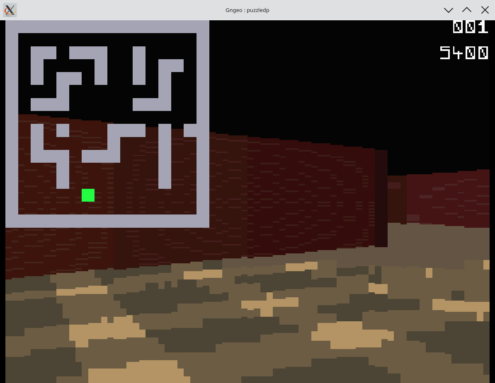
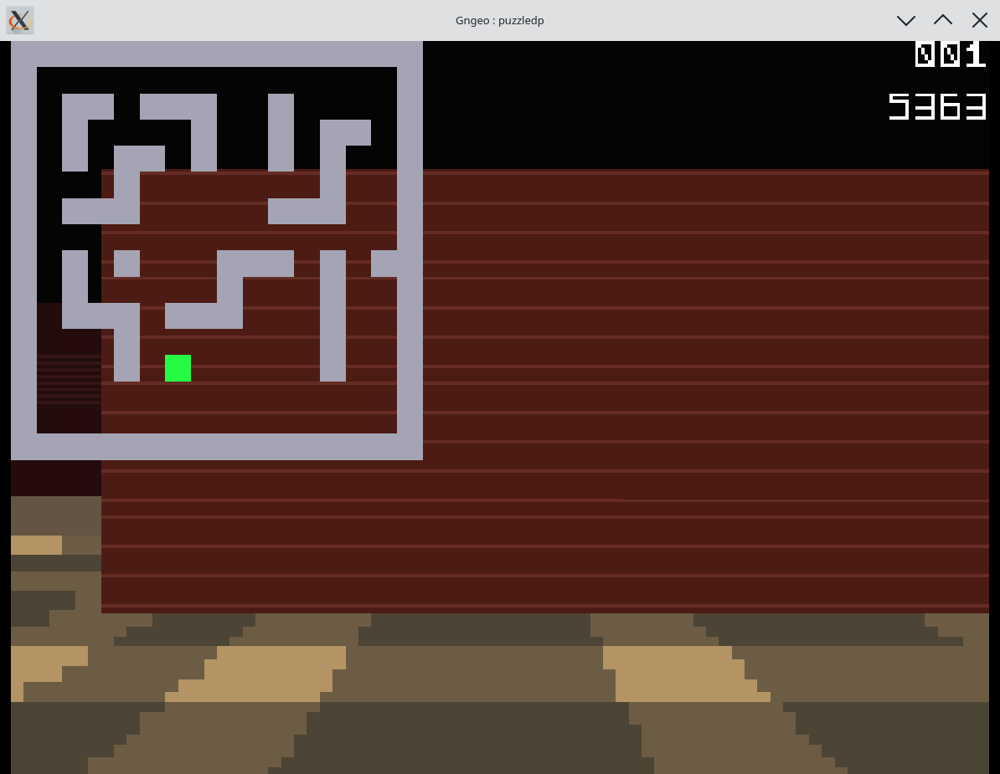
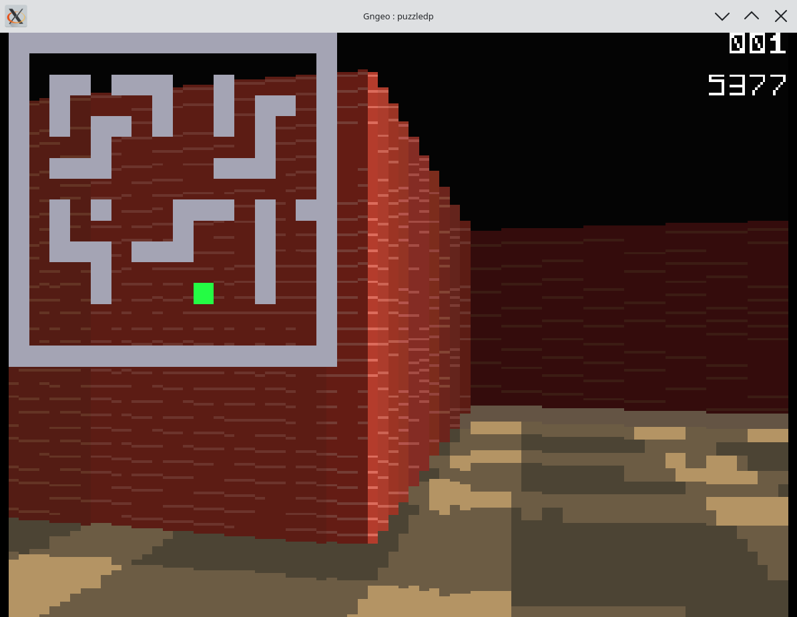

# NGRayEx — Floor Rendering on Neo Geo, with BSP as Next Target

A real-time, first-person renderer for the SNK Neo Geo AES, written in C.
The long-term goal is to replace the DDA raycaster with a proper BSP renderer
(similar to DOOM's approach), and to render fully textured floors and ceilings.

This was made purely for research purposes to understand the complexities of
rendering realtime "3D" on the Neo Geo.

---

## Current Status — Textured Floor via Per-Column Palette Encoding

The floor renderer is working visually. Each of the 80 screen columns gets its own
sprite with 15 stacked solid-color tiles. The 15 palette entries per column are set
every frame to encode 15 depth samples of the floor texture, sampled via perspective-
correct floor casting. A 3-level mip-map (LOD) reduces aliasing on far surfaces.

| | |
|---|---|
|  |  |
|  | |

**HUD (top-right corner):**
- **Top number** — FPS
- **Bottom number** — total render time of raycaster + floor render in **tenths of milliseconds**
  (e.g. `5400` = 540 ms per frame)

**The renderer is currently far too slow for real-time use (~1 FPS).**
The bottleneck is the per-pixel color calculation in the floor render:
80 columns × 15 bands = 1 200 palette writes per frame, each requiring a
perspective-correct world-space position, a texture lookup, and a PALRAM write.
On the 68000 at 12 MHz this exceeds a full frame budget by a large margin.

The clipping data (`floor_clip[0][c]` / `floor_clip[1][c]`) produced by the
raycaster is general-purpose — it marks the top and bottom of the visible floor
strip per column. The same mechanism would work unchanged for the **ceiling**;
only the floor renderer itself needs a second pass with mirrored sample positions.
Currently only the floor is rendered.

---

## Next Steps

1. **Performance** — The main bottleneck is the 1 200 PALRAM writes + 1 200
   texture lookups per frame. Strategies to investigate:
   - Pre-bake a distance-shaded color ramp and replace the perspective-correct
     world-space lookup with a simple distance index (at the cost of losing
     true texture mapping).
   - Reduce the number of palette updates per frame via dirty-tracking
     (only update columns/bands whose color changed).
   - Move palette writes to a tighter VBlank routine.

2. **Ceiling** — Mirror the floor pass: sample above the wall and write to a
   second set of per-column palette sprites. The clipping data is already there.

3. **Replace raycaster with BSP renderer** — The DDA raycaster has inherent
   limitations (no non-axis-aligned walls, no sectors with height variation).
   The next architectural step is to switch to a BSP tree + line-segment wall
   representation (DOOM-style), which enables proper portal rendering, variable
   floor/ceiling heights, and correct depth ordering without the column-by-column
   scan.

---

## How it works (current raycaster)

Every frame, for each of 80 screen columns:

1. Cast a ray through a 2D grid map until it hits a wall.
2. Measure the perpendicular distance and turn it into a slice height.
3. Write a vertical-shrink value, a Y position, and a palette into the sprite
   control block for that column's sprite.

The video chip then scales each column's brick-texture sprite to the computed
height. Floor and ceiling are a static backdrop of full-width sprites sitting
behind the walls (lower sprite indices draw first = further back). A HUD
minimap is drawn on the fix (text) layer, which always composites over sprites.

All arithmetic is 16.16 fixed-point. Rotation uses constant cos/sin multiplies.
The wall renderer writes only a few control words per column per frame; the
expensive pixel work is offloaded to the scaler hardware.

---

## Controls

| Input               | Action            |
|---------------------|-------------------|
| D-pad Up / Down     | Move forward/back |
| D-pad Left / Right  | Turn              |
| Hold A + Left/Right | Strafe            |
| C                   | Toggle minimap    |

---

## Building

Requires [ngdevkit](https://github.com/dciabrin/ngdevkit)

```sh
# graphics + sound ROMs (self-contained tile encoder)
python3 tools/gen_gfx.py

# compile and assemble the cartridge
make
```

`tools/gen_gfx.py` emits the C/S/M/V ROMs directly in the Neo Geo's planar
format, so the only ngdevkit dependency is the m68k toolchain. See the comments
at the top of each tool for details.

You must supply your own Neo Geo BIOS — it is copyrighted and not included.

Tested with [gngeo](https://github.com/dciabrin/gngeo). May not render correctly
on real hardware.

---

## Acknowledgements

Built against the [ngdevkit](https://github.com/dciabrin/ngdevkit) toolchain.
Hardware details cross-referenced from the
[Neo Geo Development Wiki](https://wiki.neogeodev.org).
